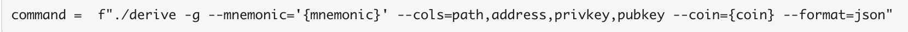
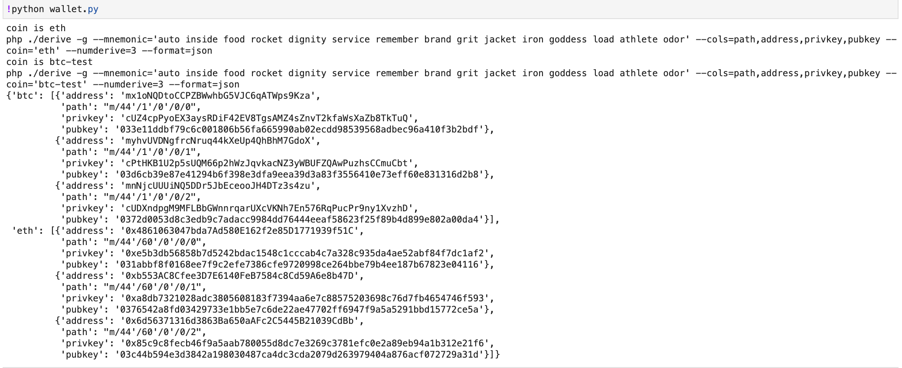

# Multi-Blockchain Wallet in Python
In this assignment, Bitcoin Testnet Transactions and Local PoA Ethereum transactions were done which involved linking the transaction signing libraries - bit and web3.py - the coding part is done in wallet.py

The following dependencies are required for this assignment and the project set up with insatllation guidelines are expalined in the instructions.md file:
 - HD Wallet Derive Installation
 - Blockchain TX Installation

Upon executing the below command, the following output is attained.
<kbd>
<kbd>

Bitcoin transaction was done using this [testnet faucet](https://testnet-faucet.mempool.co/).

