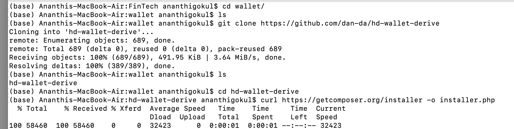
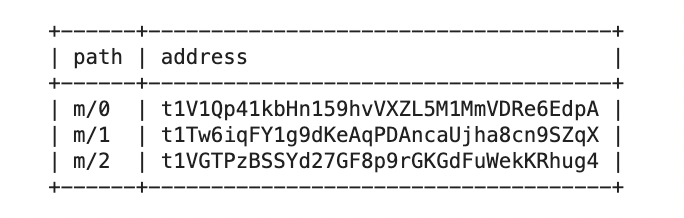
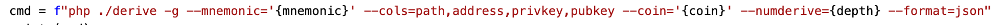
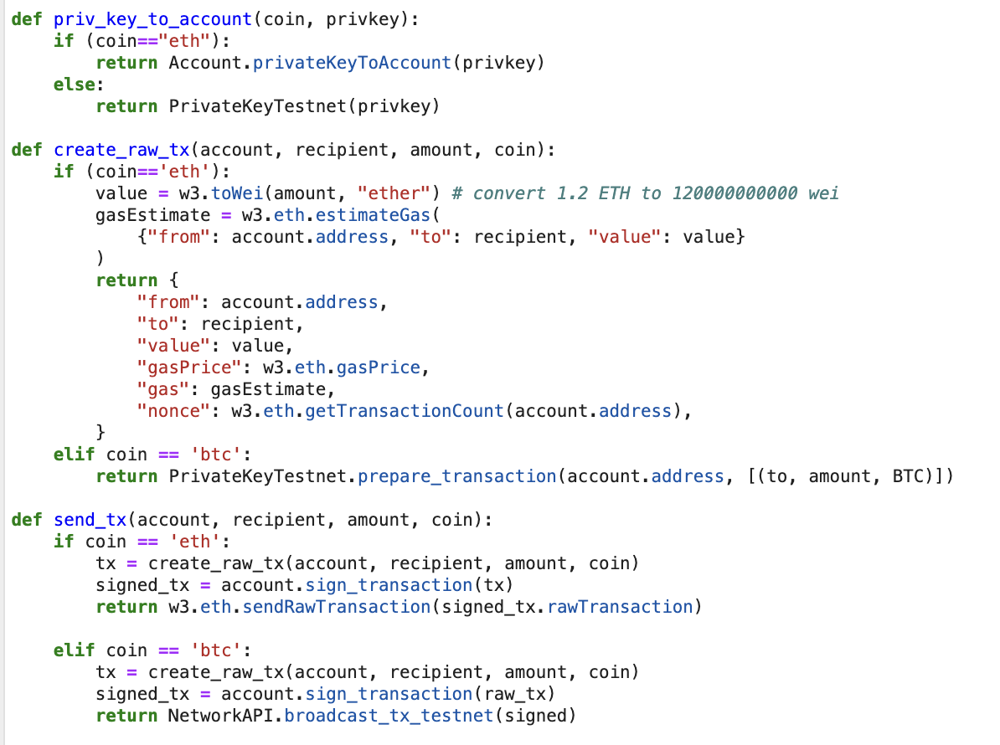
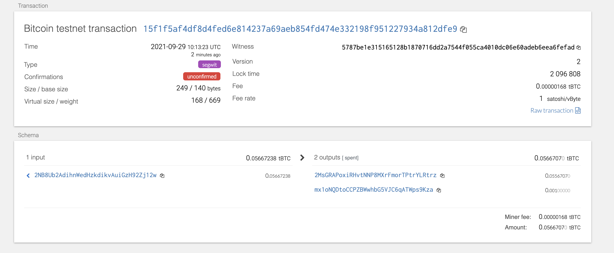
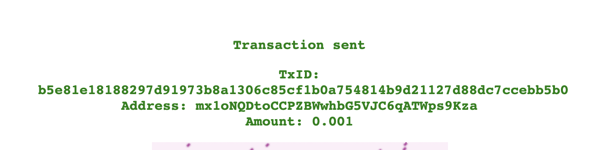
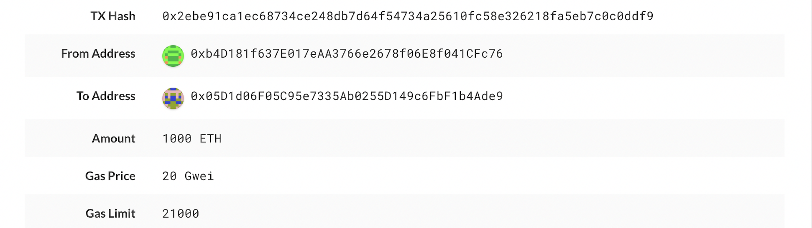

# Multi-Blockchain Wallet in Python
In this assignment, Bitcoin Testnet Transactions and Local PoA Ethereum transactions were done which involved linking the transaction signing libraries - bit and web3.py - the coding part is done in wallet.py
<kbd>

The following dependencies are required for this assignment and the project set up with insatllation guidelines are expalined in the requirements.txt file:
 - HD Wallet Derive Installation
 
 <kbd>
  
- Derived the wallet keys
  
<kbd>

 - Blockchain TX Installation

 ## Short description of the Wallet
 
- A Mnemonic was created using [the online tool](https://iancoleman.io/bip39/) initially 
 
- A php derive command is created with the Mnemonic, the coin type, also adding the numderive depth in the command defines the number of children accounts to retain from data 
<kbd>
 
- The output data is retrieved by running the above command 
 <kbd>
  
- With the privkey from the data retained and using method "priv_key_to_account" the sender Account and recipient address is fetched
- By passing the account, amount and coin details to create and send transaction functions - the transaction is done 
 <kbd> 

Bitcoin transaction was done using this [testnet faucet](https://testnet-faucet.mempool.co/).
<kbd>
 
<kbd>
 
##Local PoA Ethereum transaction
<kbd>
<kbd>
